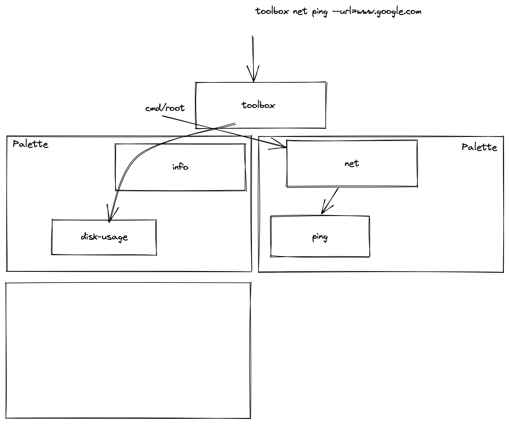

## Setup

```setup
go install github.com/spf13/cobra-cli@latest

```

## Cobra-Cli


```shell
alias cobra=cobra-cli 
# or mv $(go env GOBIN)/cobra-cli $(go env GOBIN)/cobra

cobra init 

cobra add net

#mv net to ./cmd/net

cobra add net/ping # don't do cuz package name issues

cobra add ping # refactor to net 

````